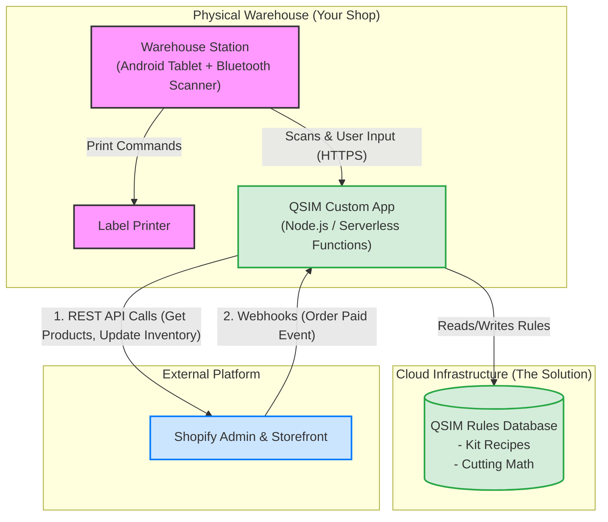

# System Architecture

This document describes the overall system architecture of the QSIM Shopify Private App.

```mermaid
graph TD
    subgraph "Physical Warehouse (Your Shop)"
        WS["Warehouse Station<br/>(Android Tablet + Bluetooth Scanner)"]
        P[Label Printer]
        WS -- "Scans & User Input (HTTPS)" --> QA
        WS -- "Print Commands" --> P
    end

    subgraph "Cloud Infrastructure (The Solution)"
        QA["QSIM Custom App<br/>(Node.js / Serverless Functions)"]
        QDB[("QSIM Rules Database<br/>- Kit Recipes<br/>- Cutting Math")]
        QA -- "Reads/Writes Rules" --> QDB
    end

    subgraph "External Platform"
        S[Shopify Admin & Storefront]
    end

    %% Connections between Cloud and External
    QA -- "1. REST API Calls (Get Products, Update Inventory)" --> S
    S -- "2. Webhooks (Order Paid Event)" --> QA

    %% Styling
    classDef warehouse fill:#f9f,stroke:#333,stroke-width:2px;
    classDef cloud fill:#d4edda,stroke:#28a745,stroke-width:2px;
    classDef external fill:#cce5ff,stroke:#007bff,stroke-width:2px;
    class WS,P warehouse;
    class QA,QDB cloud;
    class S external;
```

