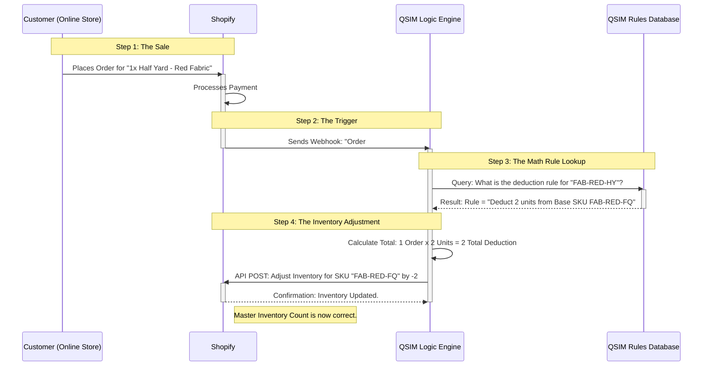

# Data Flow

This document describes the data flow through the QSIM application.

```mermaid
sequenceDiagram
    participant C as Customer (Online Store)
    participant S as Shopify
    participant QL as QSIM Logic Engine
    participant QDB as QSIM Rules Database

    Note over C, S: Step 1: The Sale
    C->>S: Places Order for "1x Half Yard - Red Fabric"
    activate S
    S->>S: Processes Payment

    Note over S, QL: Step 2: The Trigger
    S->>QL: Sends Webhook: "Order #123 Paid containing SKU: FAB-RED-HY"
    deactivate S
    activate QL

    Note over QL, QDB: Step 3: The Math Rule Lookup
    QL->>QDB: Query: What is the deduction rule for "FAB-RED-HY"?
    activate QDB
    QDB-->>QL: Result: Rule = "Deduct 2 units from Base SKU FAB-RED-FQ"
    deactivate QDB

    Note over QL, S: Step 4: The Inventory Adjustment
    QL->>QL: Calculate Total: 1 Order x 2 Units = 2 Total Deduction
    QL->>S: API POST: Adjust Inventory for SKU "FAB-RED-FQ" by -2
    activate S
    S-->>QL: Confirmation: Inventory Updated.
    deactivate S
    deactivate QL

    Note right of S: Master Inventory Count is now correct.
```

