# Inventory Management: Before QSIM vs. After QSIM (The Scan-to-Go Workflow)

This diagram clearly demonstrates the shift from a manual, risk-based process to an automated, verification-based process, focusing on the task of receiving new inventory.

```mermaid
graph TD
            subgraph "The Old Way: High Risk & Slow"
                A[Start Receiving Fabric Shipment]
                B{Look Up Product Name?}
                C[Manually Type Inventory Count]
                D{Did I Type the Correct Number?}
                E[Inventory Updated - Often Wrong]
                F[Typo / Wrong Product Selected]
                G[Future Inventory Discrepancy & Loss]
        
                A --> B
                B --> C
                C --> D
                D -- "YES (Slow)" --> E
                D -- "NO (Typo/Error)" --> F
                F --> G
        
                classDef old_flow fill:#f8d7da,stroke:#dc3545,stroke-width:2px
                class A,B,C,D,E,F,G old_flow
                class E fill:#ffc107,stroke:#dc3545
            end
        
            subgraph "The New Way: Scan. Verify. Done."
                H[Start Receiving Shipment]
                I[Action: Scan Barcode with Tablet/Phone]
                J{QSIM App Checks Barcode & SKU}
                K[Tablet Confirms: GREEN MATCH!]
                L[Action: Type Quantity & Submit]
                M[Inventory Updated - Accurate & Instant]
        
                H --> I
                I --> J
                J -- "Match Found" --> K
                K --> L
                L --> M
        
                classDef new_flow fill:#d4edda,stroke:#28a745,stroke-width:2px
                class H,I,J,K,L,M new_flow
                class K fill:#28a745,color:#fff
            end

```

