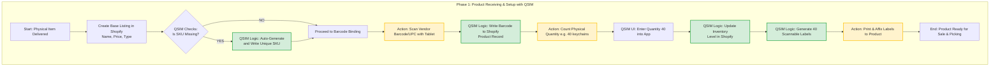

# New Product Receiving Workflow with QSIM

This flowchart shows the clean, sequential steps for receiving a new item (like a keychain or a bolt of fabric) and making it scannable.

```mermaid
graph TD
            subgraph "Phase 1: Product Receiving & Setup with QSIM"
                A[Start: Physical Item Delivered] --> B["Create Base Listing in Shopify\nName, Price, Type"]
        
                B --> C{"QSIM Checks:\nIs SKU Missing?"}
                C -- YES --> D["QSIM Logic: Auto-Generate\nand Write Unique SKU"]
                C -- NO --> E[Proceed to Barcode Binding]
                D --> E
        
                E --> F[Action: Scan Vendor Barcode/UPC with Tablet]
                F --> G["QSIM Logic: Write Barcode to Shopify\nProduct Record"]
        
                G --> H[Action: Count Physical Quantity e.g. 40 keychains]
                H --> I[QSIM UI: Enter Quantity 40 into App]
        
                I --> J["QSIM Logic: Update Inventory\nLevel in Shopify"]
        
                J --> K[QSIM Logic: Generate 40 Scannable Labels]
                K --> L[Action: Print & Affix Labels to Product]
                L --> M[End: Product Ready for Sale & Picking]
            end
            
            classDef success fill:#d4edda,stroke:#28a745,stroke-width:2px
            class D,G,J,K success
            classDef action fill:#fff3cd,stroke:#ffc107,stroke-width:2px
            class F,H,L action
```