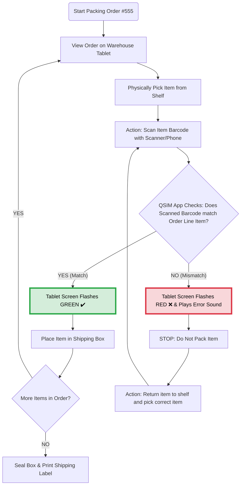

# User Workflow

This document describes the user workflow for the QSIM application.

```mermaid
graph TD
    Start(Start Packing Order #555) --> View[View Order on Warehouse Tablet];
    View --> Pick[Physically Pick Item from Shelf];
    Pick --> Scan[Action: Scan Item Barcode with Scanner/Phone];
    
    Scan --> QSIM{QSIM App Checks: Does Scanned Barcode match Order Line Item?};
    
    QSIM -- YES (Match) --> Green[Tablet Screen Flashes GREEN ✔️];
    Green --> Pack[Place Item in Shipping Box];
    Pack --> Next{More Items in Order?};
    Next -- YES --> View;
    Next -- NO --> Seal[Seal Box & Print Shipping Label];
    
    QSIM -- NO (Mismatch) --> Red[Tablet Screen Flashes RED ❌ & Plays Error Sound];
    Red --> Stop[STOP: Do Not Pack Item];
    Stop --> Correct[Action: Return item to shelf and pick correct item];
    Correct --> Scan;

    %% Styling for visual impact
    classDef success fill:#d4edda,stroke:#28a745,stroke-width:4px,color:#000;
    classDef error fill:#f8d7da,stroke:#dc3545,stroke-width:4px,color:#000;
    class Green success;
    class Red error;
```

